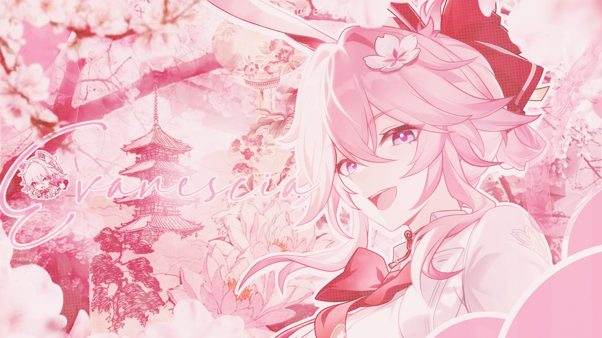

  

<h1 align="center">Hi, I'm Ngọc Ánh 👋</h1>

## 🥀 About me

- 🎓 I'm currently a student studying Software engineering

- 💻 I'm interested in backend web development, API Design & Software Architecture

- 🌱 I'm currently learning Java, Python, Docker & Kubernetes,...

- 🎯 Fun fact: I believe a strong developer mindset isn't built on success, but on making countless mistakes along the way.

 

## 🛠️ Languages & Tools

  

## 📊 GitHub Stats

  
  

## 📈 GitHub Commit

## 📫 Contact

  <!-- GitHub -->
  
  <!-- Gmail -->
  
  <!-- LinkedIn -->
  

